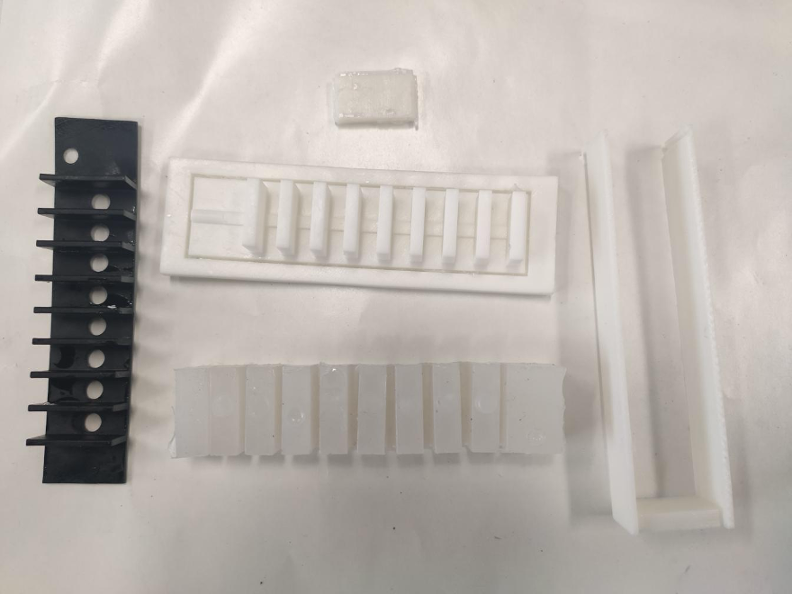
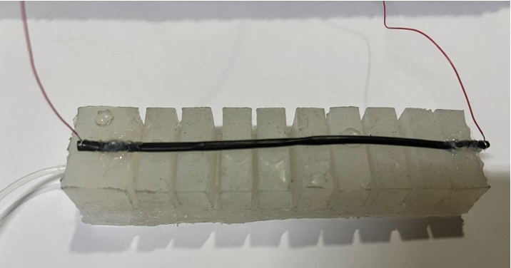
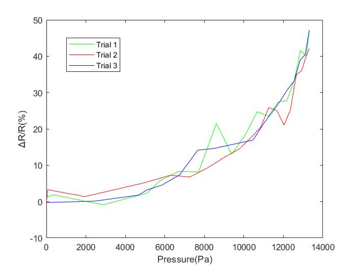
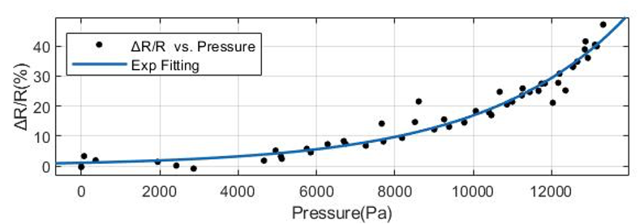

# Self-Sensing Soft Robotics Control System 

An Arduino-based soft robotic gripper capable of sensing contact through pressure and a custom-built flexible resistance sensor.  
This project characterizes the **sensor–actuator response curve** (ΔR/R vs. pressure) and **lays the foundation for future slip detection and adaptive gripping control**.

---

## Features
- Custom-built pneumatic actuation system with flexible resistance sensor  
- Real-time acquisition of pressure and ΔR/R signals  
- Characterization of sensor–actuator dynamic response curves  
- Planned: slip detection and adaptive pressure control

---

## Hardware Components

- Soft Robot,Microcontroller,Pressure Sensor,Flexible Sensor,Solenoid Valve,Relay,Air Pump 

 

## Experimental Procedure
### 1. Molding

  

### 2. Testing

  
  
  

### 3. Flexible Sensor Integration

  

### 4. Data Collection

  
  

### 5. Visualization

  

### 6. Curve Fitting

  

**Model**:  
\[
f(x) = 1.049*exp(0.0002777*x)
\]

*(95% confidence bounds: a = 0.7021–1.397, b = 0.0002507–0.0003046)*

## Future Work
- Implement real-time slip detection  
- Add adaptive pressure control loop  
- Improve filtering and stability for longer runs  
- Integrate multiple fingers for full soft robotic hand

